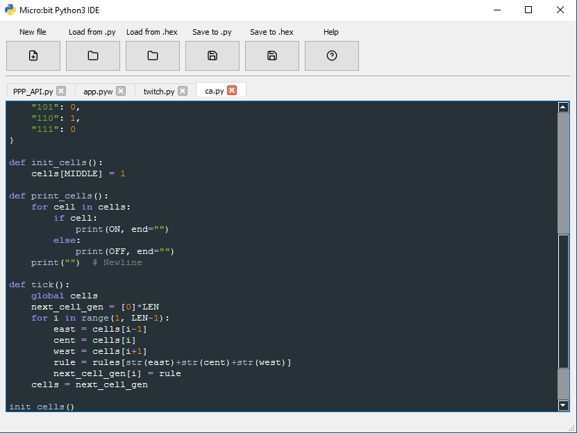

# Component_3 - BBC Micro:Bit Python IDE

The final product:

## res -> py

`pyuic5 file.ui -o file.py`

`pyrcc5 res.qrc -o res_rc.py`

## Notes / Used sources

Icons from https://feathericons.com/

Qt5 Stuff:
https://stackoverflow.com/
http://zetcode.com/gui/pyqt5
http://projects.skylogic.ca/blog/how-to-install-pyqt5-and-build-your-first-gui-in-python-3-4/
http://pyqt.sourceforge.net/Docs/PyQt4/qfiledialog.html

Syntax highlighter help:
https://github.com/art1415926535/PyQt5-syntax-highlighting
http://carsonfarmer.com/2009/07/syntax-highlighting-with-pyqt/
https://regex101.com/
http://www.rexegg.com/regex-quickstart.html
http://www.december.com/html/spec/colorsvg.html
